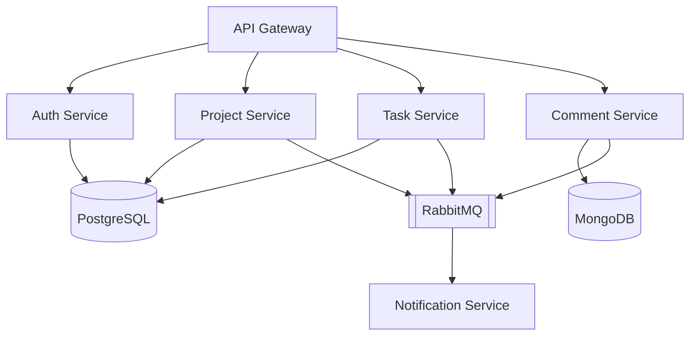

# WorkSphere Deployment


Microservice application deployment with RabbitMQ, PostgreSQL and MongoDB

## 📋 Prerequisites

- Docker 26.1.3+
- docker-compose 2.35+
- Git
- 4GB+ RAM on server

## 🚀 Quick Deployment

```bash
# Clone repository (SSH)
git clone git@github.com:sanazez/work-sphere-deploy.git && cd work-sphere-deploy

# Prepare environment
cp .env.example .env
nano .env  # Configure your settings

# Start services
docker-compose up -d
```

## 🌐 Service Endpoints

### Core Services

| Service       | Type   | URL Format            | Default Port | Credentials               |
| ------------- | ------ | --------------------- | ------------ | ------------------------- |
| API Gateway   | HTTP   | `http://<host>:3000`  | 3000         | JWT Token                 |
| RabbitMQ UI   | Web UI | `http://<host>:15672` | 15672        | `admin` / `RABBITMQ_PASS` |
| RabbitMQ AMQP | AMQP   | `amqp://<host>:5672`  | 5672         | `admin` / `RABBITMQ_PASS` |

## 🏗️ Architecture Overview



## ⚙️ Management Commands

### Core commands

### View logs (all services)

docker-compose logs -f

### View specific service logs

docker-compose logs -f rabbitmq

### Stop all services

docker-compose down

### Restart specific service

docker-compose restart api-gateway

## 🔒 Security

1. Change all default credentials
2. Restrict access to ports 15672 and 5432
3. Set up regular backups

## ⚠️ Troubleshooting

### RabbitMQ not starting?

```bash
docker-compose logs rabbitmq
df -h  # Check disk space
```

### API connection issues?

```bash
curl -v http://localhost:3000/health
docker-compose ps
```

## 🔄 Updates

```bash
git pull origin main
docker-compose pull
docker-compose up -d --build
```
